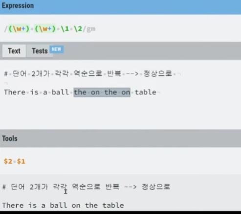

# 정규 표현식

---

## 정규표현식이란?

- 텍스트를 검색하고 치환에 사용한다.
- 수십 라인의 프로그래밍 없이 정규식 1~2줄로 대부분의 문자열 작업 가능
- 선배들의 노하우가 담긴 파워풀한 텍스트 관련 도구
- 익숙해진다면 손 빠른 개발에 큰 도움을 줄 수 있다.
- 온전한 프로그래밍 언어는 아님
- 다른 프로그래밍 언어나 제품에 포함된 `작은 언어`의 느낌
- 제품마다 조금씩 다른 문법

---

## 사용예시

- email, 주민번호, 생년월일 등의 형식 검증
- 텍스트를 취급하는 개발 코드 작성
- (텍스트) 데이터의 전처리 작업
- 프로젝트 리팩토링 작업
- Database 검색, 치환 작업

---

## 사용처

- IDE, 편집기등에서도 사용
- 각종언어에서도 사용
- Cloud Flare => 웹 어플리케이션 방화벽
  - 글로벌한 회사에서도 웹 방화벽의 내용은 정규표현식이 포함되어있다.
  - 무언가 단계가 누락되는 바람에 CPU에게 100%정도의 부하가 있었고 작동하지 못하는 사건이 있었다.

---

## 정규 표현식 온라인 테스트 도구

- https://regexr.com
- 정규 표현식을 만든 것을 여기서 연습하고 저장하면 나중에 편한가 보다.

---

## 문자 하나 찾기

- 일반적인 문자 그대로 기재
- '.' 와 같은 메타 문자를 검색하려면 '\'로 이스케이프

---

## 문자 집합으로 찾기

- 대괄호([])를 사용하여 문자 집합 표현
- [] 집합에 속한 문자 가운데 하나가 일치
- [] 내에 '-'은 연속 요소를 표현 [1-5] => [12345] => 유니코드와 연관이 있다.
- 캐럿('^')문자는 집합 안에 있는 문자나 범위를 모두 제외

---

## 반복 찾기

- 파워풀한 정규 표현의 패턴 능력
- '+' : 하나 이상 일치
- '\*' : 없거나 하나 이상 일치
- '?' : 없거나 하나 일치
- 중괄호 '{}'내에 반복횟수 기재 {3} : 3번
- 게으른 수량자로 문자를 최소로 일치

---

## 위치 찾기

- 텍스트 영역 내 특정 위치에서 검색 희망
- '\b' : 단어 경계
- '^' : 문자열 경계의 시작
- '$' : 문자열 경계의 끝

---

## 하위 표현식

- 큰 표현식 안에 속한 일부 표현식을 한 항목으로 다루도록 묶음
- '()' : 괄호로 묶음 기능
- &gt;{2,} vs (&gt;){2,}
- 파워풀한 중첩된 하위 표현식

---

## 하위 표현식 - 역참조

- 하위 표현식으로 매칭된 타겟을 참조
- 일치한 부분을 반복해 찾거나 치환에 사용
- 텍스트를 검색하고 치환하는데 매우 유용
- 'There is a ball on the table.' - 실수로 중복된 전치사?

---

## 전방 탐색

- 일치 영역을 발견해도 그 값을 반환하지 않는 패턴
- 실제로는 하위 표현식이며 같은 형식으로 작성
- (?=일치할 텍스트)

---

## 후방 탐색

- 전방 탐색과 동일한 개념으로 방향만 역방향
- (?<=일치하 텍스트)

---

## 전후방 탐색 동시 사용

---

## 문제

- `/(\w+)(\w+)\1\2/m`
- 밑에는 치환 ($2 $1)

---

## 마지막으로

- 비개발자도 알아두면 유용한 도구
- 텍스트를 다루는 작업에 파워풀한 도구
- 이해가 아닌 체득의 영역

---
